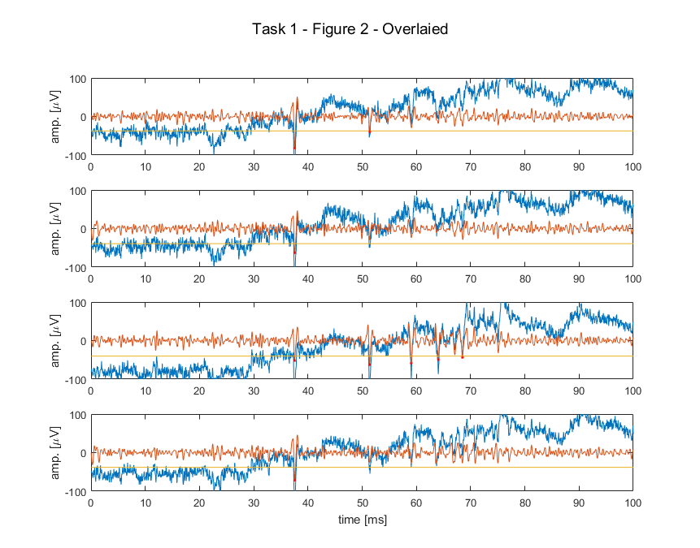
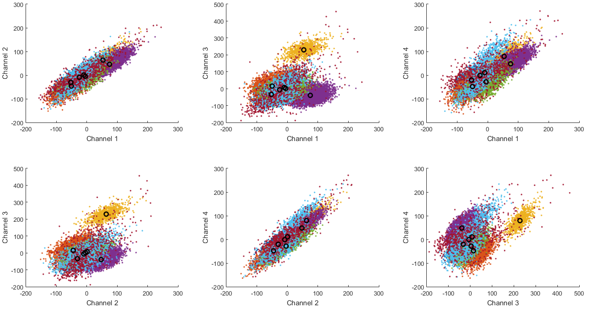
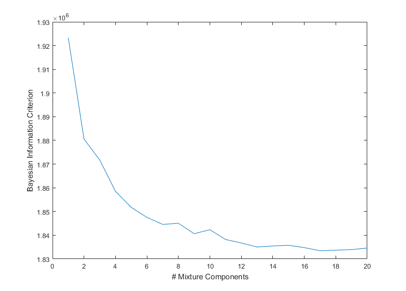
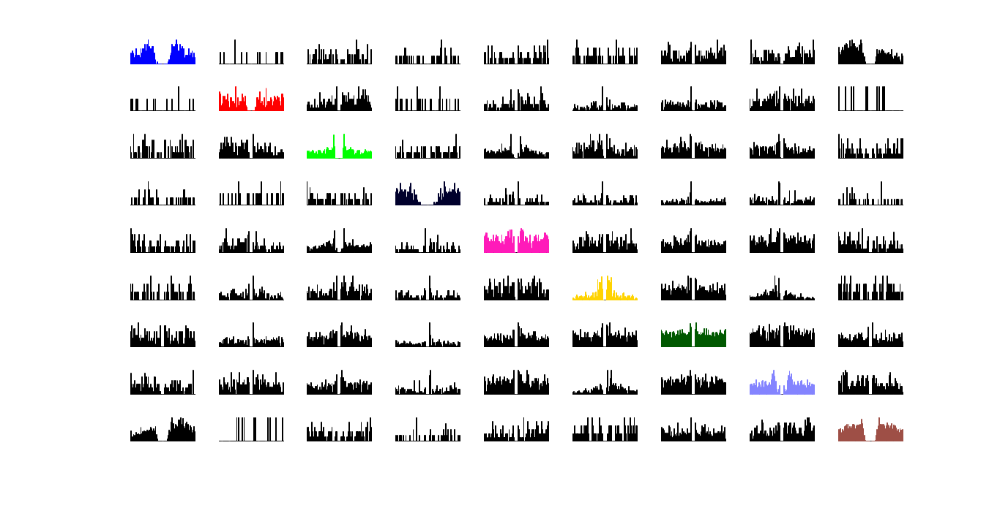
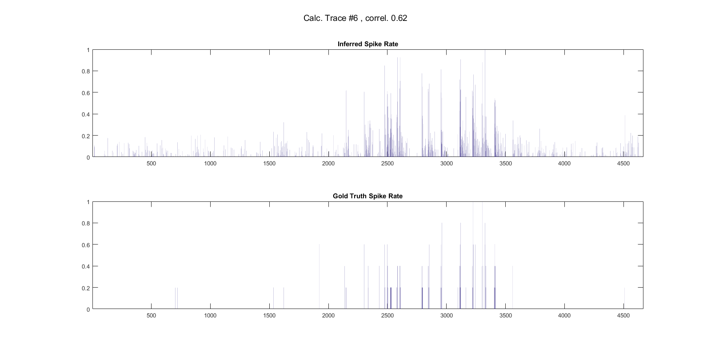
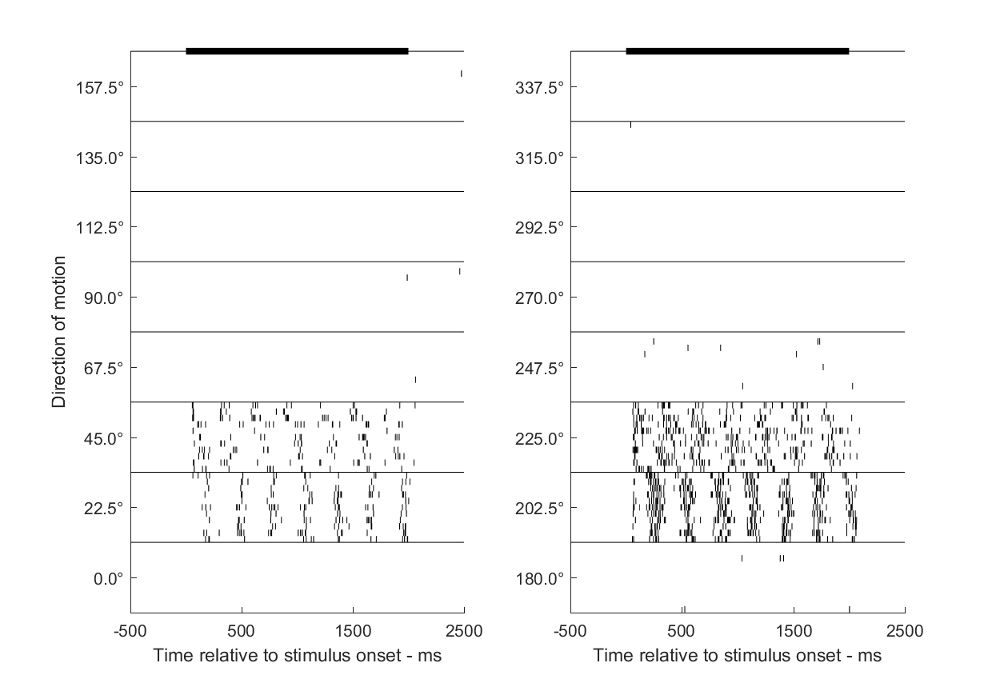
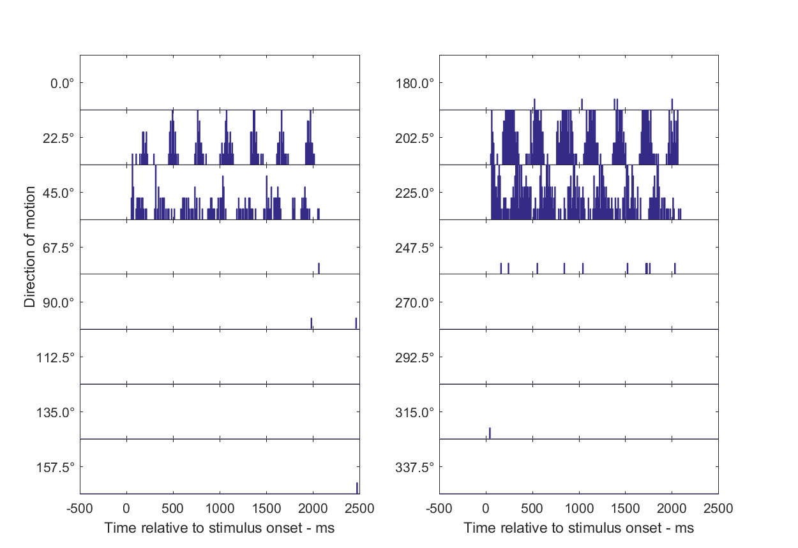
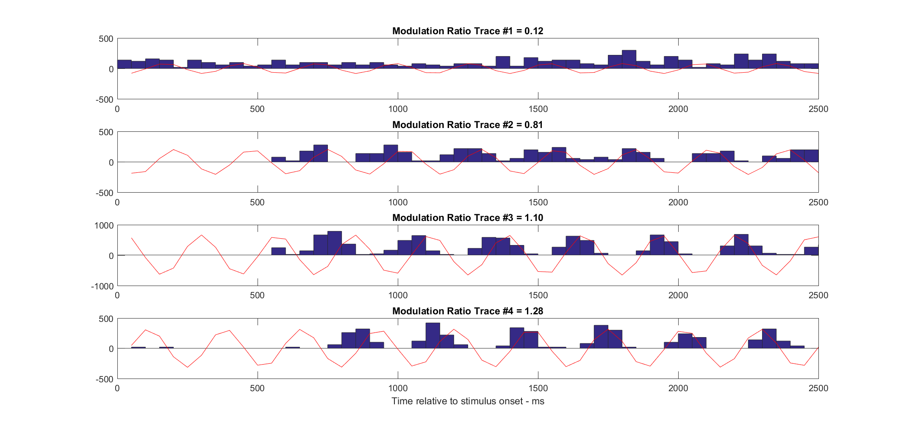
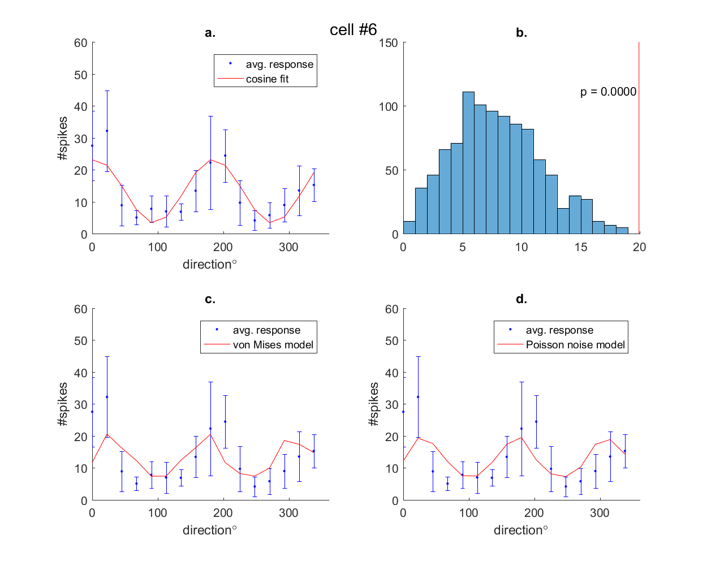
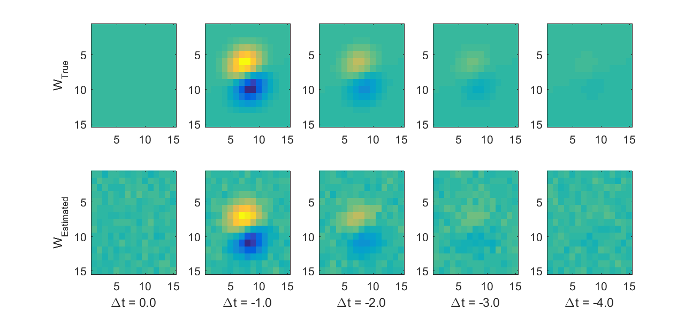

# Neural Data Analysis

## Spike detection, Feature extraction
[Code in Matlab](NDA_T1/main.m)

Spike detection and feature extraction from continuous tetrode recordings
<!---->

## Spike Sorting with Mixture of Gaussians
[Code in Matlab](NDA_T2/main.m)

Clusters and their means found in the PCA data.

Bayesian information criterion dependent on the number of mixture components.

## Identifying single neurons with Cross-correlograms
[Code in Matlab](NDA_T3/main.m)

Cross-correlation between the diferent clusters. Auto-correlation plots are marked in the respective color of its cluster.

## Spike inference from calcium data
[Code in Matlab](NDA_T4/main.m)

Inferring spike rates from a calcium trace obtained by calcium imaging.

## Raster plot
[Code in Matlab](NDA_T5/main.m)

Each line in certain direction group indicates the timings of the spike occurrence relative to the stimulus onset. The solid black line on the top of the figure indicates the timing of the stimulus.

## Peri-Stimulus Time Histogram
[Code in Matlab](NDA_T5/main.m)

Histogram method for spike rate estimation

## Linearity Index
[Code in Matlab](NDA_T5/main.m)

The modulation ratio is the amplitude of first harmonic R(F1) divided by the mean spike rate R(F0) for an optimal achromatic drifting sinusoidal grating stimulus. High values of R(F1)/R(F0) indicate that the cells are modulated by spatial pattern in the visual image. Low values of R(F1)/R(F0) signify that such cells are excited, but their spike rate is not modulated up and down by the passage of the bars of a drifting grating.(Skottun et al., 1991; Ringach et al., 2002)
Below we see PSTH for each cell in condition with the most spikes overlaying the sinusoid at modulation frequency of the stimulus.

## Tuning curves
[Code in Matlab](NDA_T6/main.m)

Different tuning curve models were fitted to neurophysiological data of cells
responding to a grating moving in different directions.

a. Fitting cosine tuning curve. b. Test for significant orientation selectivity; distribution of |q| under the null hypothesis c.Fit tuning curve using von Mises model d. Fit tuning functions using Poisson noise model. Red line in a,b,c indicates average responses to all conditions.

## Spatio-Temporal Receptive Fields
[Code in Matlab](NDA_T7/main.m)

To estimate the receptive feld of a neuron which responds to white-noise stimulus with the given spike counts, we assume a Linear-Nonlinear Poisson model.In this model w corresponds to the receptive field of the neuron.

